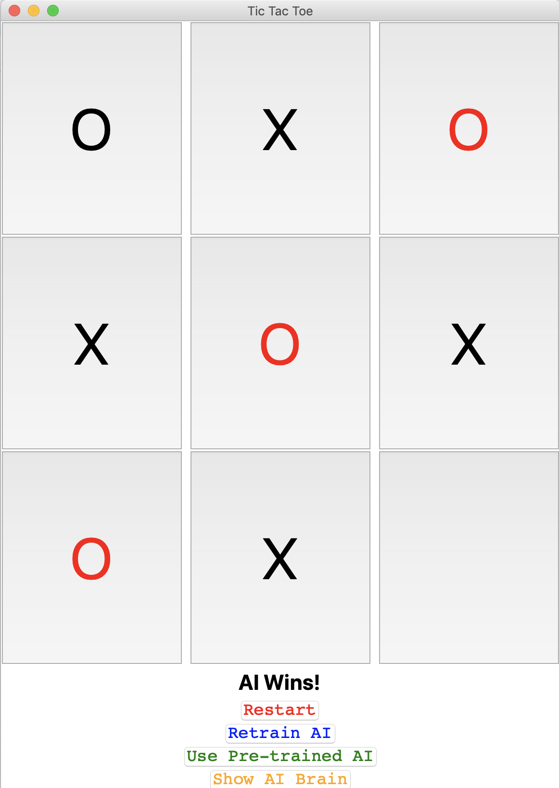

# Artificial Intelligence Game Bots
These projects contain Q Learning based AI trained to defeat humans in common games

## Tic Tac Toe

A classic tac-tac-toe game. Here a Q learning agent is trained on a number of games, enabling the bot to defeat human players.

###  Getting Started
1. Install pre-requisites
    ```
    pip3 install -r requirements.txt
    ```
2. Run application
    ```
    python3 tictactoe.py 
    ```
    
###  Game Play
1. Enter number of games for the AI to train on

    
    
2. Wait for Training to complete
    ```
    Training Artificial Intelligence
    AI Finished Playing 1000 games...
    AI Finished Playing 2000 games...
    AI Finished Playing 3000 games...
    AI Finished Playing 4000 games...
    AI Finished Playing 5000 games...
    Training Complete!
    ```
3. Observe the AI's 'brain'
    ```
    {'XOOXOO-XX': -0.855, 'XOOXO--X-': -0.7310249999999999, ... } 
    ```
4. Play the game by click on one of the 9 squares !

    

5. Click 'restart' to paly another game

## Authors

* **Nasheb Ismaily** 

## License

This project is licensed under the MIT License - see the [LICENSE.md](LICENSE.md) file for details